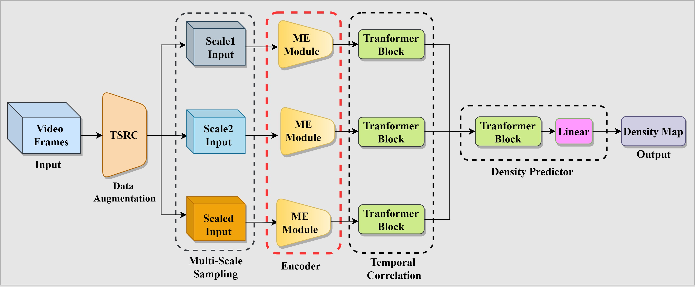

# ME-RAC: Multi-path 3D-Conv Encoder and Temporal Sequence Decision for Repetitive Actions Counting


This repository is the implementation for paper "Multi-path 3D-Conv Encoder and Temporal Sequence Decision for Repetitive Actions Counting"



## Overview
This repository contains the implementation of **ME-RAC** for repetitive-action counting in videos. The ME-RAC model introduces a multipath 3D-Conv encoder for enhanced temporal-spatial feature extraction and incorporates a **Temporal-Sequence Decision (TSD)** framework for counting repetitive actions in long, complex videos. The project aims to address challenges in repetitive-action counting, such as overfitting, limited generalization, and complex scene dynamics.

## Contributions
- **Multipath 3D-Conv Encoder (ME-RAC):** Utilizes multiscale 3D convolution kernels to enhance temporal-spatial feature extraction.
- **Temporal-Sequence Random Combination (TSRC) Data Augmentation:** Prevents overfitting during training by introducing temporal-sequence diversity.
- **Temporal-Sequence Decision (TSD) Framework:** A two-stage system for accurate repetitive-action counting in long, realistic video scenarios.

## Citation
If you find this repository helpful, please consider citing:

```bibtex
@article{QIU2024123760,
title = {Multipath 3D-Conv encoder and temporal-sequence decision for repetitive-action counting},
journal = {Expert Systems with Applications},
volume = {249},
pages = {123760},
year = {2024},
issn = {0957-4174},
doi = {https://doi.org/10.1016/j.eswa.2024.123760},
url = {https://www.sciencedirect.com/science/article/pii/S0957417424006262},
author = {Yicheng Qiu and Li Niu and Feng Sha},
}
```

## Reference
[https://github.com/SvipRepetitionCounting/TransRAC](https://github.com/SvipRepetitionCounting/TransRAC)  
[https://github.com/open-mmlab/mmaction2](https://github.com/open-mmlab/mmaction2)

## License 
This project is licensed under the Apache 2.0 License, please click [LICENSE](LICENSE) for more details.

